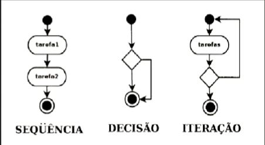

# Programação Estruturada

É um tipo de programação que foi desenvolvida baseada em modularização, onde a ideia é dividir um programa em unidades menores conhecidas como procedimentos ou funções; Cada uma dessas unidades são construidas para desempenhar uma tarefa específica diversas vezes.
 
Na programação estruturada os procedimentos ou funções se interligam através do uso de três mecanismos básicos que seguem:
* Sequência: são representados os passos para executar determinada rotina em um programa;
* Decisão: é permitido selecionar um determinado fluxo para executar uma rotina dentro do programa;
* Iteração é permitida a execução repetitiva de um determinado bloco de comandos do programa;

## Sequencial 

* Movimentação
* Calculos
* Leitura

## Condicionais

 Se (condição) então 
    instruções verdade
 Senão
    Instroções falsas
 FimSe   

 ## Repetição

 Para de 1 até 10
 Fim
 Enquanto
    (condição verdadeira) faça
 Fim
 Repita
 Até (condição verdadeira)    

 A programação estruturada tem como características principais a facilidade de leitura do código e entendimento da estrutura do programa, mas em contrapartida não tem flexibilidade e gera executáveis grandes para execução.

São exemplos de linguagem de programação estruturada: COBOL, PL/I, PASCAL, C. 