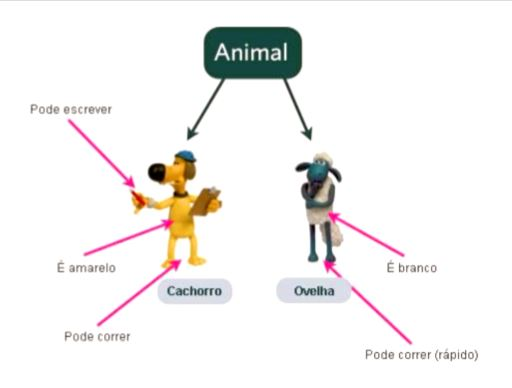

# Programação Orientada a Objetos

A programação Orientada a Objetos é definida para atender a necessidade de tratamento dos elementos participantes da estrutura do negócio em análise, como foco de atuação e colaboração entre eles. Cada elemento, denominado por objeto, possui identificações e procedimentos próprios (métodos) que realizam toda movimentação e comportamento do objeto dentro do contexto do negócio.

A linguagem adota o conceito de objetos, mas para implementação da lógica também utiliza as estruturas sequenciais, condicionais e repetição, como a programação estruturada.

As principais características apresentadas para a linguagem Orientada a Objetos, são: flexibilidade e reutilização.  Flexibilidade pois a disponibilização de procedimentos independentes faz com que a manutenção seja mais ágil e não crie dependência dentro da equipe de desenvolvimento.  Essa independência dos procedimentos gera ainda a reutilização, ou seja, a possibilidade de um mesmo procedimento ser utilizado em vários pontos do sistema.

São exemplos de linguagem de programação estruturada: JAVA, C++, Python, PHP, dentre outros.

