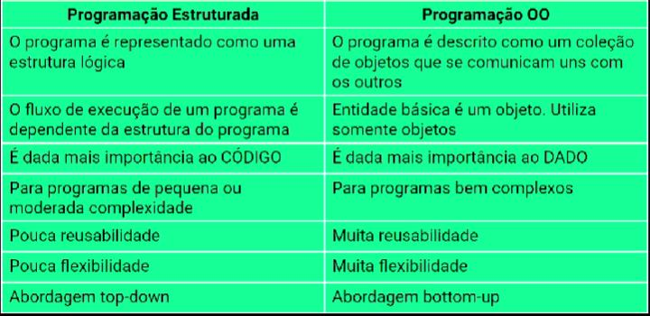

# PE vs POO

## Paradigmas de programação
É a maneira como o desenvolvedor vai fazer para programar seu sistema

## Sistema de Biblioteca

### Análise de projeto Orientado a objetos 
Decomposição por objetos do conceito

Catálogo  Bibliotecário
Livro     Biblioteca

### Análise de Projeto estruturados
Decomposição por função dos processos

Sistema
Cadastrar -> Cadastrar Livros -> Informar multas

## Características fundamentais:
* Manutenção: Por estar trabalhando em pedaços (objetos) se quero dar manutenção basta eu mexer nesse objeto.
* Extensibilidade: Eu consigo aumentar meu sistema sem impactar o que já foi construído. E mesmo que eu tenha que fazer isso, é muito mais dinâmico e prático fazer.
* Reuso: Se eu tenho por exemplo uma formatação de data. Essa formatação pode ser usada em toda a aplicação.
* Componentização: Eu posso fazer do meu projeto ser um componente para ser usado em outro sistema. Exemplo: Tenho um componente no meu sistema que trata como vai ser gerado todos os meus relatórios. Esse componente vai servir para várias outras aplicações.