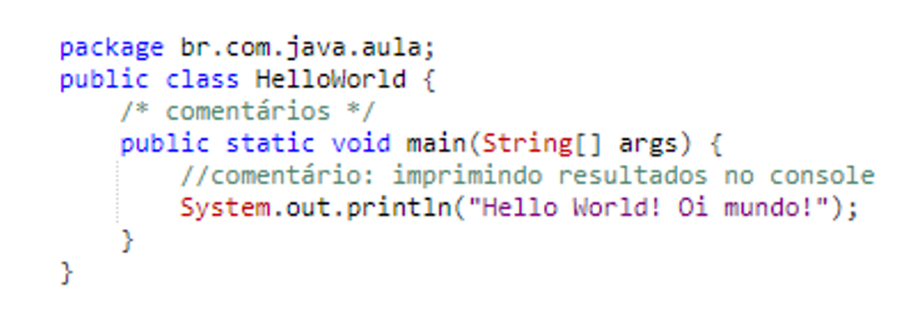
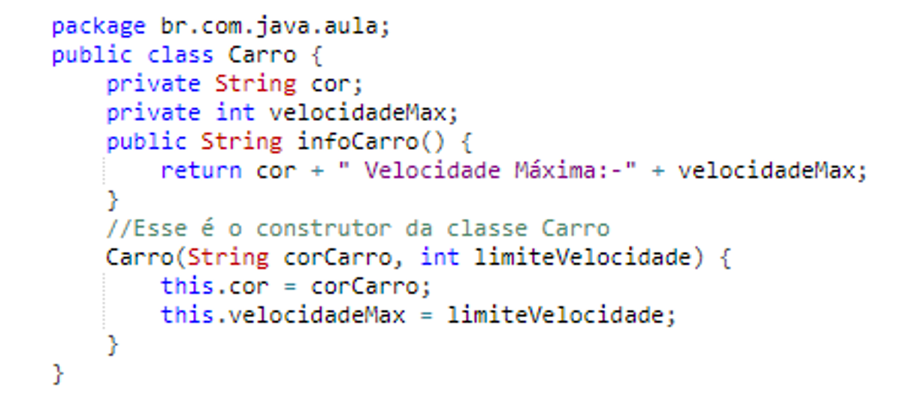
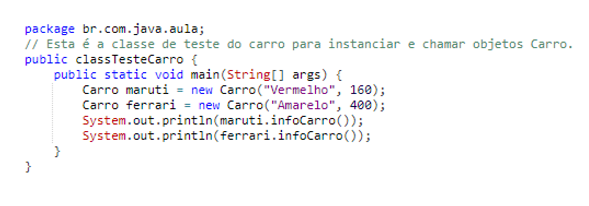
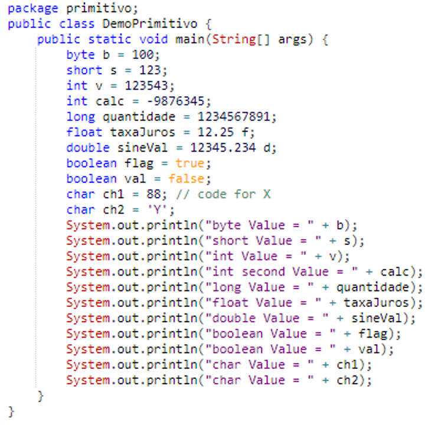
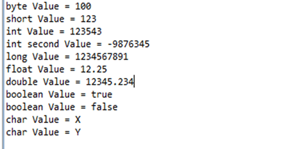

# Introdução a linguagem Java

Sumário:

* Por que Java? / vantagens de aprender java
* Estrutura da classe java / entenda como funciona a estrutura de uma classe java
* Diretrizes de programação / convenção e escrevendo código Java
* Tipos de dados / entendendo os tipos de variáveis que podemos usar

## Por que Java?

* Base para aprender qualquer outra linguagem

* Linguagem mais utilizada

* Java é multiplataforma

* Baseado no desenvolvimento no Paradigma Orientado a objetos

* Oportunidade de emprego

Como acontece? 

Criar código Java -> Compilar código Java -> Leitura do código Java
Pode usar editor de texto ou IDE para fazer isso ->  Feito por uma linha de comando ou a própria IDE faz -> Feito pela JVM com base na JRE. 

## Estrutura do programa Java

* Pacotes

* Importação de pacotes

* Classe

* Variáveis

* Método

* Comentários de uma linha, várias linhas e documentação Java

* Imprimir algo

## Diretrizes de programação 

* Nomenclatura de acotes

* Nomenclatura de classes

* Nomenclatura de Métodos

* Nomenclatura de variáveis

* Palavras chaves

## Tipos de dados

Inteiros: 
* Esse grupo inclui byte, short, int e long que são para números assinados com valor inteiro

Números de ponto flutuante:
* Esse grupo inclui float e double, que representam números com precisão fracionária

Caracteres:
* Esse grupo inclui caracteres (char), que presentam simbolos em um conjunto de caracteres, como letras e números

Booleano:
* Este grupo incui booleano (boolean), que é um tipo especial para apresentar valores verdadeiros/ falsos

Java é uma das linguagens de programação mais populares usadas em aplicações críticas. Pode ser utilizado para desenvolvimento de aplicações desktop, sistemas para web, dispositivos móveis, cartões de crédito, televisões digitais, geladeiras entre outros. Porém, não é apenas uma linguagem de programação, Java é uma completa plataforma de desenvolvimento e execução, composta por três pilares:

● A máquina virtual java (JVM);

● Um completo conjunto de APIs (bibliotecas);

● A linguagem Java.

Java está presente nos principais sistemas operacionais existentes, entre eles: Windows, Linux, Unix, Mac e Solaris.  É uma tecnologia independente de sistema operacional e hardware. O Java foi desenvolvido por James Gosling da Sun Microsystems em 1995 como uma linguagem orientada a objetos para aplicativos de negócios de uso geral e aplicativos interativos da Internet baseados na Web. O objetivo era fornecer uma alternativa independente de plataforma ao C ++. Em outros termos, é arquitetonicamente neutro, o que significa que você pode usar o Java para escrever um programa que será executado em qualquer plataforma ou dispositivo (sistema operacional). O programa Java pode ser executado em uma ampla variedade de computadores porque não executa instruções diretamente no computador. Em vez disso, o Java é executado em uma Java Virtual Machine (JVM).

## O ciclo de vida do programa Java

Java requer que o código fonte do seu programa seja compilado primeiro. Ele é convertido em código específico da máquina ou em um código de bytes que é entendido por algum mecanismo de tempo de execução ou uma máquina virtual java.

Não apenas o programa será verificado quanto a erros de sintaxe por um compilador Java, mas algumas outras bibliotecas de código Java podem ser adicionadas (vinculadas) ao seu programa após a conclusão da compilação

Etapa 1: Crie um documento de origem usando qualquer editor e salve o arquivo como .java (por exemplo, abc.java)

Etapa 2: Compile o arquivo abc.java usando o comando “javac” ou o eclipse o compilará automaticamente logo que você salvar.

Etapa 3: o código de bytes (abc.class) será gerado no disco.

Etapa 4: esse código de byte pode ser executado em qualquer plataforma ou dispositivo com JVM (java.exe converte código de byte em linguagem de máquina)

## Terminologias usadas por programadores Java

 * JDK (Java Development Kit): O JDK contém o JRE, juntamente com várias ferramentas de desenvolvimento, como bibliotecas Java, compiladores, depuradores, ferramentas de empacotamento e implementação

 * JRE (Java Runtime Environment): faz parte do JDK, mas pode ser usado independentemente para executar qualquer código de bytes (programa java compilado). Pode ser chamado como implementação da JVM.

 * JVM (Java Virtual Machine): ‘JVM’ é um software que pode ser portado para várias plataformas de hardware. A JVM se tornará uma instância do JRE no tempo de execução do programa Java. Os códigos de bytes são o idioma da máquina para a JVM. Como uma máquina de computação real, a JVM possui um conjunto de instruções que manipula várias áreas da memória em tempo de execução. Assim, para diferentes plataformas de hardware, corresponde à implementação da JVM disponível como JREs fornecidos pelo fornecedor.

 * API Java (Application Programming Interface): conjunto de classes escritas usando a linguagem de programação Java que é executada na JVM. Essas classes ajudarão os programadores, fornecendo métodos padrão, como ler no console, gravar no console, salvar objetos na estrutura de dados etc.

## Vantagens da linguagem de programação Java

 * Suporte interno para multithreading, comunicação de soquete e gerenciamento de memória (coleta automática de lixo).

 * Orientado a objeto (OO).
 
 * Oferece suporte a aplicativos baseados na Web (Applet, Servlet e JSP), aplicativos distribuídos (soquetes, RMI, EJB etc.) e protocolos de rede (HTTP, JRMP etc.) com a ajuda de extensas APIs padronizadas (Application Programming Interfaces).

## Estrutura do programa Java

Vamos usar o exemplo do programa Java HelloWorld para entender a estrutura e os recursos da classe. Este programa foi escrito em poucas linhas e sua única tarefa é imprimir “Hello World! Oi mundo!” na tela.

Vamos explicar a seguir cada trecho do código:

 ## 1)   “pacote br.com.java.aula”:

É uma declaração de declaração de pacote. A instrução package define um espaço para nome no qual as classes são armazenadas. O pacote é usado para organizar as classes com base na funcionalidade. Se você omitir a instrução do pacote, os nomes das classes serão colocados no pacote padrão, que não tem nome. A declaração do pacote não pode aparecer em nenhum lugar do programa. Deve ser a primeira linha do seu programa ou você pode omiti-lo.

## 2)   “public class HelloWorld”:

Esta linha tem vários aspectos da programação java.

 * public: Esta é a palavra-chave modificadora de acesso que informa o acesso do compilador à classe. Vários valores de modificadores de acesso podem ser públicos, protegidos, privados ou padrão (sem valor).
 * class: esta palavra-chave usada para declarar uma classe. Nome da classe (HelloWorld) seguido por esta palavra-chave.

## 3)   Comentários:

Podemos escrever comentários em java de duas maneiras.

 * Comentários da linha: começa com duas barras (//) e continua até o final da linha atual. Os comentários da linha não requerem um símbolo final.
 * Os comentários do bloco começam com uma barra e um asterisco (/ ) e terminam com um asterisco e uma barra ( /). Os comentários do bloco também podem se estender por quantas linhas forem necessárias.

## 4)   “public static void main (String [] args)”:

Seu método (Função) chamado main com array de strings como argumento.

 * public: Modificador de acesso
 * static: static é uma palavra-chave reservada, o que significa que um método é acessível e utilizável, mesmo que não exista nenhum objeto da classe.
 * void: palavra-chave declara que nada seria retornado do método. O método pode retornar qualquer primitivo ou objeto.
 * Conteúdo do método dentro de chaves. {}

## 5)   System.out.println (“Hello World! Oi mundo!”):

a)   System: É o nome da classe de utilitários Java.

b)  out: é um objeto que pertence à classe System.

c)   println: É o nome do método utilitário que é usado para enviar qualquer String para o console.

d)  “Hello World! Oi mundo!”: é literalmente String definido como argumento para o método println.

## Classes em Java

Java é uma linguagem orientada a objetos, o que significa que possui construções para representar objetos do mundo real. Cada programa Java possui pelo menos uma classe que sabe como fazer certas coisas ou como representar algum tipo de objeto. Por exemplo, a classe mais simples, Hello World, sabe como “cumprimentar” o mundo.

As classes em Java podem ter métodos (ou funções) e campos (ou atributos ou propriedades). Vamos dar um exemplo do objeto Carro, que possui várias propriedades, como cor, velocidade máxima, etc., juntamente com funções como correr e parar. No mundo Java, vamos representá-lo como abaixo:

Vamos criar uma classe chamada TesteCarro, que instancia o objeto da classe Carro e chama o método infoCarro e vê a saída.

Podemos executar o programa JavaTesteCarro porque ele possui o método principal. O método principal é o ponto de partida para qualquer execução de programa java. Executar um programa significa dizer à Java Virtual Machine (JVM) para “Carregar a classe e começar a executar o método main (). Continue executando até que todo o código no main seja concluído”.

## Diretrizes de programação

Os identificadores Java devem começar com uma letra, um caractere de moeda ($) ou um caractere de conexão, como o sublinhado (_). Identificadores não podem começar com um número. Após o primeiro caractere, os identificadores podem conter qualquer combinação de letras, caracteres monetários, caracteres de conexão ou números. Por exemplo,

 * int variável1 = 10; // Isso é válido
 * int 4var = 10; // isso é inválido, o identificador não pode começar com um dígito.

Identificadores, nomes de métodos e nomes de classes diferenciam maiúsculas de minúsculas; var e Var são dois identificadores diferentes. Você não pode usar palavras-chave Java como identificadores.

Para classes e interfaces a primeira letra deve ser maiúscula e, se várias palavras estiverem vinculadas para formar o nome, a primeira letra das palavras internas deverá estar em maiúsculas (um formato que às vezes é chamado de “camelCase”).

Para os métodos a primeira letra deve estar em minúscula e, em seguida, devem ser usadas camelCase. Veja os exemplos de nomes de métodos abaixo:

 * getBalance
 * doCalculation
 * setCustomerName

Para as variáveis o formato camelCase deve ser usado, começando com uma letra minúscula. É recomendado nomes curtos e significativos, o que nos parece bom. Alguns exemplos:

 * buttonWidth
 * saldoDaConta
 * empName

Para definir uma constante é criada uma variável ​​estática e final. As constantes devem ser nomeadas usando letras maiúsculas com caracteres sublinhados como separadores:

MIN_HEIGHT

Pontos importantes a serem observados, pode haver apenas uma classe pública por arquivo de código-fonte. Além disso, os comentários podem aparecer no início ou no final de qualquer linha no arquivo de código-fonte; eles são independentes de qualquer uma das regras de posicionamento discutidas aqui. Outro ponto é que se houver uma classe pública em um arquivo, o nome do arquivo deverá corresponder ao nome da classe pública. Por exemplo, uma classe declarada como “public class Cachorro {}” deve estar em um arquivo de código-fonte chamado Cachorro.java.

## Tipo de dados primitivos em Java

Nem tudo em Java é um objeto. Há um grupo especial de tipos de dados (também conhecidos como tipos primitivos) que são usados ​​com bastante frequência na programação. Por motivos de desempenho, os desenvolvedores da linguagem Java decidiram incluir esses tipos primitivos. Java determina o tamanho de cada tipo primitivo. Esses tamanhos não mudam de um sistema operacional para outro. Esse é um dos principais recursos da linguagem que torna o Java tão portátil. Java define oito tipos primitivos de dados: byte, short, int, long, char, float, double e boolean. Os tipos primitivos também são comumente referidos como tipos simples, que podem ser colocados em quatro grupos:

 * Inteiros: esse grupo inclui byte, curto, int e long, que são para números assinados com valor inteiro.
 * Números de ponto flutuante: esse grupo inclui float e double, que representam números com precisão fracionária.
 * Caracteres: esse grupo inclui caracteres(char), que representam símbolos em um conjunto de caracteres, como letras e números.
 * Booleano: este grupo inclui booleano(boolean), que é um tipo especial para representar valores verdadeiros / falsos.

É bom escolher o tipo primitivo certo para economizar memória. Porque as variáveis ​​alocam espaço na memória do computador. Por exemplo: para armazenar muitos números no intervalo de -128 a 127 na matriz, declare suas variáveis ​​como byte, não  int ou long.

1.   int ntVariável = 24; // usa 32 bits de memória

2.   long longVariable = 24L; // usa 64 bits de memória

3.   byte byteVariable = 24; // usa 8 bits de memória

No exemplo acima, armazenamos o número 24 em 3 variáveis ​​com diferentes tipos primitivos. Observe a quantidade de alocação de memória para os três tipos. Byte é 4 vezes menor que int 8 vezes menor que long.

Vamos discutir cada um em detalhes:

●     byte

O menor tipo inteiro é byte. Tem um valor mínimo de -128 e um valor máximo de 127 (inclusive). O tipo de dados de bytes pode ser útil para economizar memória em matrizes grandes, onde a economia de memória realmente importa. As variáveis ​​de bytes são declaradas pelo uso da palavra-chave byte. Por exemplo, o seguinte declara e inicializa variáveis ​​de bytes chamadas b:

byte b = 100;

●     short:

O tipo de dados curto é um inteiro de complemento de dois de 16 bits e assinado. Tem um valor mínimo de -32.768 e um valor máximo de 32.767 (inclusive). Assim como no byte, as mesmas diretrizes se aplicam: você pode usar um pequeno para economizar memória em matrizes grandes, em situações em que a economia de memória realmente importa. O exemplo a seguir declara e inicializa a variável curta chamada s:

short curto = 123;

●     int:

O tipo inteiro mais comumente usado é int. É um tipo assinado de 32 bits que tem um intervalo de –2.147.483.648 a 2.147.483.647. Além de outros usos, variáveis ​​do tipo int são comumente empregadas para controlar loops e indexar matrizes. Esse tipo de dados provavelmente será grande o suficiente para os números que seu programa usará, mas se você precisar de um intervalo maior de valores, use por muito tempo.

int v = 123543;

int calc = -9876345;

●     long:

Long é um tipo assinado de 64 bits e é útil para aquelas ocasiões em que um tipo int não é grande o suficiente para armazenar o valor desejado. Possui um valor mínimo de -9.223.372.036.854.775.808 e um valor máximo de 9.223.372.036.854.775.807 (inclusive). O uso desse tipo de dados pode estar no aplicativo bancário quando uma quantidade grande deve ser calculada e armazenada.

long longoVal = 1234567891;

●     float:

Os números de ponto flutuante, também conhecidos como números reais, são usados ​​ao avaliar expressões que requerem precisão fracionária. Por exemplo, cálculo da taxa de juros ou cálculo da raiz quadrada. O tipo de dados flutuante é um ponto flutuante IEEE 754 de 32 bits e precisão única. Como nas recomendações para byte e short, use um ponto flutuante (em vez de duplo) se precisar economizar memória em grandes matrizes de números de ponto flutuante. O tipo float especifica um valor de precisão único que usa 32 bits de armazenamento. A precisão única é mais rápida em alguns processadores e ocupa metade do espaço da precisão dupla. A declaração e a sintaxe de inicialização das variáveis ​​flutuantes fornecidas abaixo, observe “f” após a inicialização do valor.

float taxaJuros = 12.25f;

●     double:

A precisão dupla, como indicado pela palavra-chave double, usa 64 bits para armazenar um valor. A precisão dupla é realmente mais rápida do que a precisão única em alguns processadores modernos que foram otimizados para cálculos matemáticos de alta velocidade. Todas as funções matemáticas transcendentais, como sin (), cos () e sqrt (), retornam valores duplos. A sintaxe da declaração e inicialização para variáveis ​​duplas fornecidas abaixo, observe “d” após a inicialização do valor.

double duplo = 12345.234d;

●     boolean:

O tipo de dados booleano possui apenas dois valores possíveis: verdadeiro e falso. Use esse tipo de dados para sinalizadores simples que rastreiam condições verdadeiras / falsas. Este é o tipo retornado por todos os operadores relacionais, como no caso de a <b. booleano também é o tipo exigido pelas expressões condicionais que governam as instruções de controle, como if ou while.

boolean val = false;

●     Caracteres:

Em Java, o tipo de dados usado para armazenar caracteres é char. O tipo de dados char é um único caractere Unicode de 16 bits. Ele tem um valor mínimo de ‘\ u0000’ (ou 0) e um valor máximo de ‘\ uffff’ (ou 65.535 inclusive). Não há caracteres negativos.

char ch1 = 88; // código para X

char ch2 = ‘Y’;

## Variáveis primitivas

1.   Variável de nível de classe (instância):

Não é obrigatório inicializar a variável de nível de classe (instância). Se não inicializamos, o compilador de variáveis ​​de instância atribui o valor padrão a ele. De um modo geral, esse padrão será zero ou nulo, dependendo do tipo de dados. Contudo, confiar nesses valores padrão é geralmente considerado uma prática ruim de codificação.

## Variável local do método:

As variáveis ​​locais do método precisam ser inicializadas antes de usá-lo. O compilador nunca atribui um valor padrão a uma variável local não inicializada. Se você não conseguir inicializar sua variável local onde ela é declarada, certifique-se de atribuir um valor a ela antes de tentar usá-la. O acesso a uma variável local não inicializada resultará em um erro em tempo de compilação. Vamos ver um programa java simples que declara, inicializa e imprime todos os tipos primitivos.

Classe Java DemoPrimitivo como abaixo:

Saída da classe DemoPrimitivo acima, como abaixo:

