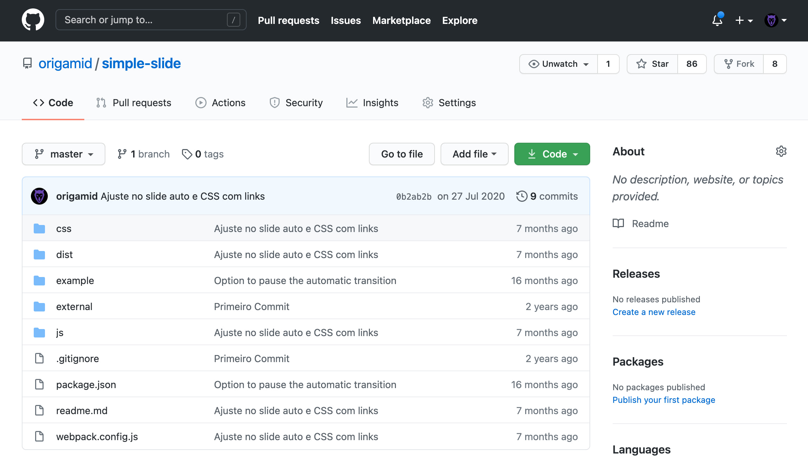

# O Curso 

### 💡 Aula 01 

## UI Design para Iniciantes
* User Interface (Interface de Usuário) Design, User Experience (Experiência do Usuário) Design, Figma, Cores, Tipografia, Espaço e mais.

## Ferramenta
* Figma

### 💡 Aula 02

# Design é Projeto
## Plano
* Limites (sim/não = objetivos) e Pesquisa (contexto)

## Execução
* Desenho (protótipo/entrega) e Testes (iteração/melhorias)

## Plano
Por mais simples que um menu se pareça, existe muita pesquisa e planejamento por trás da criação do mesmo.

## Execução
A execução do projeto é feita em etapas, cada etapa prioriza uma parte do projeto. Testar o artefato final é essencial para garantirmos uma boa experiência (ux).

## Design é Intenção
* Escolhas são feitas para alcançamos os objetivos de maneira eficiente.

## Análise
Podemos analisar/especular os motivos por trás de cada escolha.

### 💡 Aula 03

# UI Design
## UI = User Interface = Interface de Usuário
* Foco no aprendizado de interfaces digitais.

## Elementos da Interface
* Formas, espaço, cores, tipografia, imagens e ícones.

## Interface de Usuário
Interfaces digitais são compostas por textos, textos funcionais, botões, imagens, ícones, vídeos e outros elementos.

## Elementos da Interface
As escolhas devem ser consistentes com o projeto. É na consistência que criamos uma unidade, e fazemos com que todos os elementos da interface pareçam pertencer a mesma.

## Importância dos Elementos
A ausência de um elemento apenas, pode arruinar o seu projeto.

# Boa Interface
## Propósito

* Existe um motivo claro para a existência do elemento.

## Consistência
* Os elementos se comunicam visualmente. Cores em harmonia, espaçamentos equivalentes, ícones de uma mesma família e mais.

## Necessários
* A remoção do mesmo tornaria a experiência pior.

* Os ícones são consistentes

* O botão mais importante possui o maior contraste

* As informações disponíveis possuem propósito

### 💡 Aula 04

# UX Design
## UX = User Experience = Experiência do Usuário
* Design que envolve os usuários impactados pelo projeto.

## Heurísticas e Pesquisa
* Boas práticas / entender as necessidades e comportamento.

## UX e UI
Ambos possuem UX e UI, o contexto de uso/usuário define o ideal.

## Usuário
O comportamento do usuário deve guiar as nossas escolhas.

## Heurísticas
Boas práticas definidas através de pesquisas e observações.

## Facilite o escaneamento das informações
* Os usuários geralmente escaneiam o conteúdo através de links, títulos e listas.

## Opções visíveis são mais acessadas
* Mantenha visível os links para as principais partes do site.

Hearst, M. A. (1999). User interfaces and visualization. Modern information retrieval, 257-323.

https://www.nngroup.com/articles/hamburger-menus/

# Heurísticas Aplicada

https://stripe.com/pt-br-ie

## Pesquisa
UX Design é 80% pesquisa com os usuários impactados pelo projeto.

## Empatia
* Pesquisa com usuários, concorrentes, especialistas e estudos.

## Definir
* Definir os problemas que serão o foco do projeto.

## Idealizar
* Definir ideias que podem solucionar o problema.

## Prototipar
* Materializar soluções a partir das ideias definidas.

## Testar
* Testar a solução com o usuário final e identificar melhorias.

Processo de Design Thinking d.school - Stanford

Exercício
Assistir vídeo sobre UX Design:

https://www.youtube.com/watch?v=ZXapXz6iPKs

### 💡 Aula 05

# Design e Desenho
Você não precisa saber desenhar para trabalhar como designer. É uma habilidade que pode te ajudar, mas não é vital.

## Foco
Você não precisa criar a ilustração/foto/vídeo, mas deve saber como/onde utilizá-lo.

Exercício
Selecione 10 projetos que você goste em cada um dos sites abaixo:

https://dribbble.com/search/ui

https://www.typewolf.com/
