# Componentes

* Menu
* Tabs
* Breadcrumb
* Footer

## Menu Principal (Header)

### Marca
* Na esquerda, clica volta para a home.

### Menu
* Na direita, o mais simples possível.

### Busca?
* Campo de busca em sites de conteúdo (YouTube, Github).

### Fixo?
* Depende do tamanho do conteúdo, se for fixo e grande diminuir o mesmo.

Anatomia de um cabeçalho (header) simples em seu formato desktop e mobile.
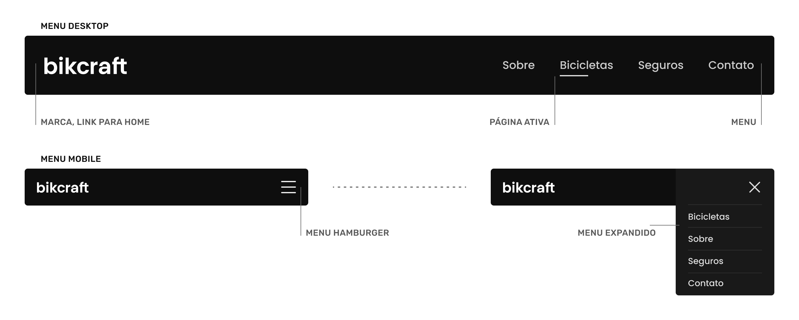

Praticamente todos os cabeçalhos abaixo seguem a estrutura básica, porém com modificações para as necessidades do site.
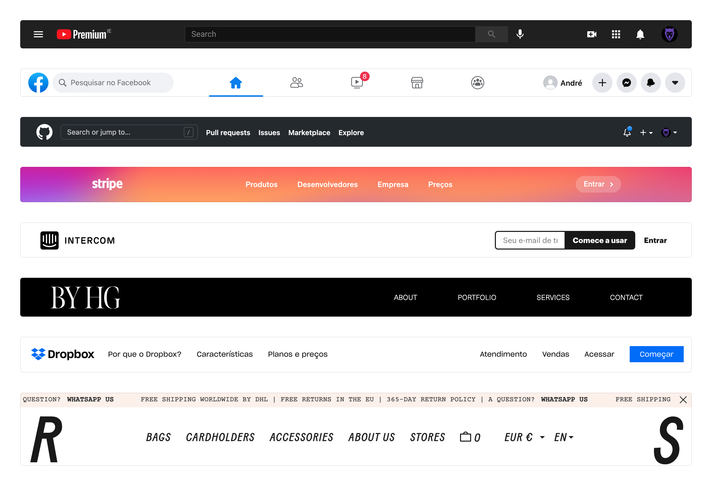

https://www.intercom.com/

https://www.studiobyhg.com/home

https://en.rsvp-paris.com/

## Menu Secundário
Serve para expandir as opções do menu principal.

No site da RSVP e da Apple ícones e imagens são utilizadas para diferenciar os itens do menu secundário.

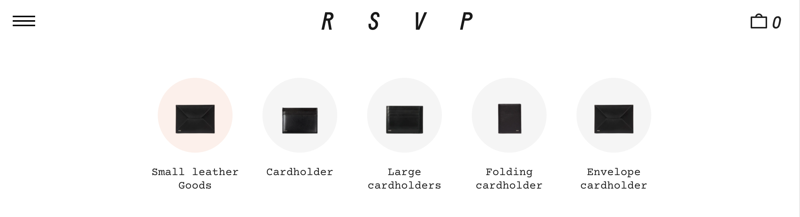

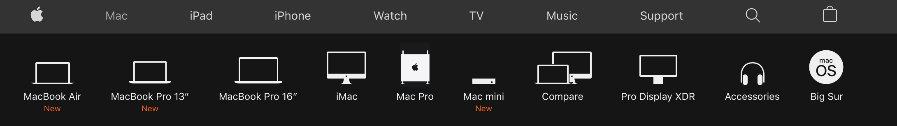

Na documentação do Vue.js o menu secundário serve para informar ao usuário todas as seções que existem na documentação.

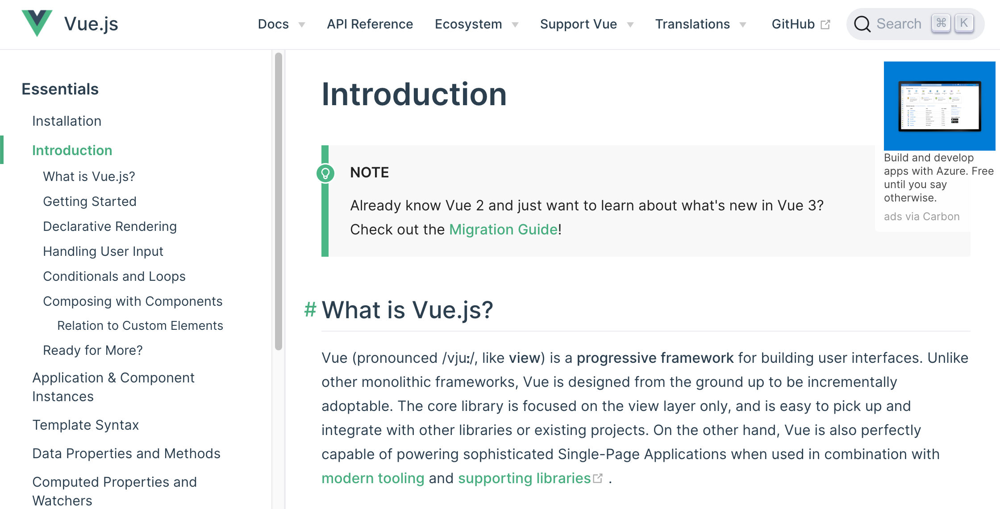

## Tabs
As Tabs (abas), são menus localizados que geralmente não levam o usuário para outra página, mas sim para um novo conteúdo no mesmo local. As tabs são inspiradas em arquivos físicos, onde etiquetas indicam o conteúdo.

### Clicável
* Indicar que a aba é clicável.

### Estado
* Indicar claramente qual aba está ativa no momento.

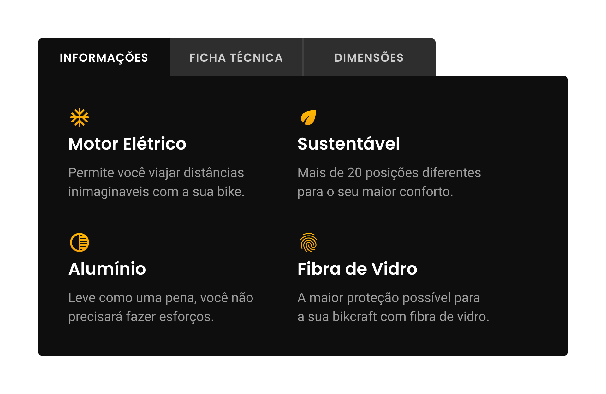

A navegação por abas por ser utilizada de diversas formas diferentes, com imagens, ícones, marcas, etc. O princípio dela é ter uma lista que controle a troca de conteúdo.

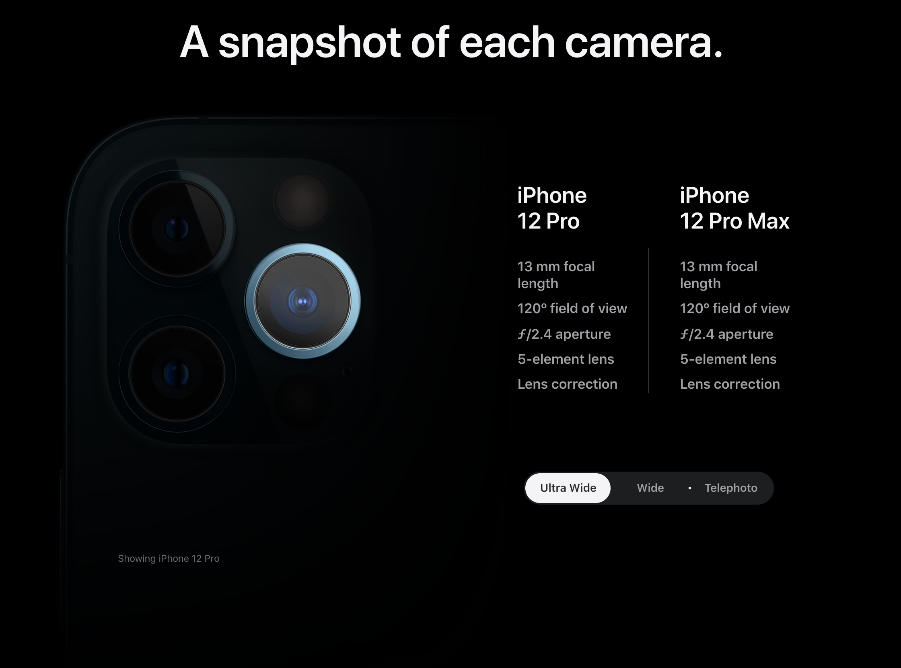

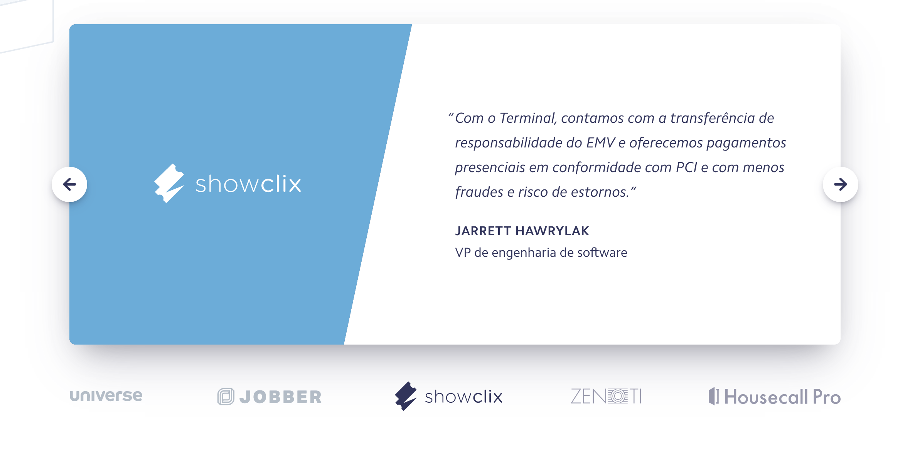

Breadcrumb
O uso de breadcrumb (migalhas de pão) é comum em sites que possuam diversos níveis e subníveis de informações, como em um comércio eletrônico.

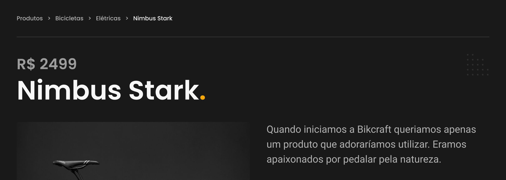

## Footer
O Footer (rodapé) do site é geralmente utilizado para colocarmos um mapa de links do site. Não precisa ter exatamente todos os links, mas geralmente contém itens importantes que não fazem parte do menu principal, como: termos e condições ou a política de privacidade do site.

### Contato
* Colocar no footer as principais informações de contato.

### Links Importantes
* Ter links importantes que não foram colocados no menu principal.

### Redes Sociais
* Ter os links para as principais redes sociais utilizadas pela empresa.

O Stripe por ser um site complexo, aproveita o footer para colocar diversos links importantes para o site.

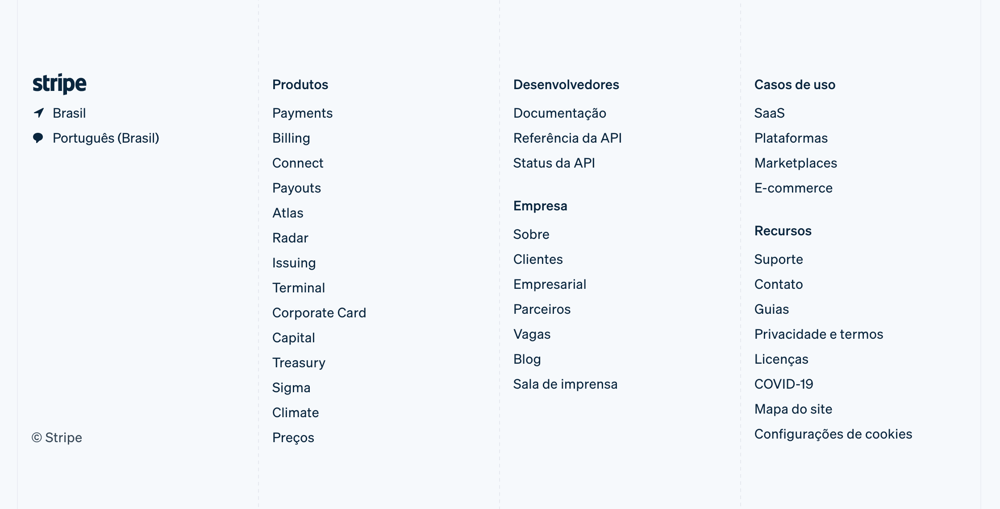

https://stripe.com/br

O site da RSVP o footer é utilizado para disponibilizar dados de contato da sua principal loja, outros links importantes, links para redes sociais e também um formulário para captura de emails.

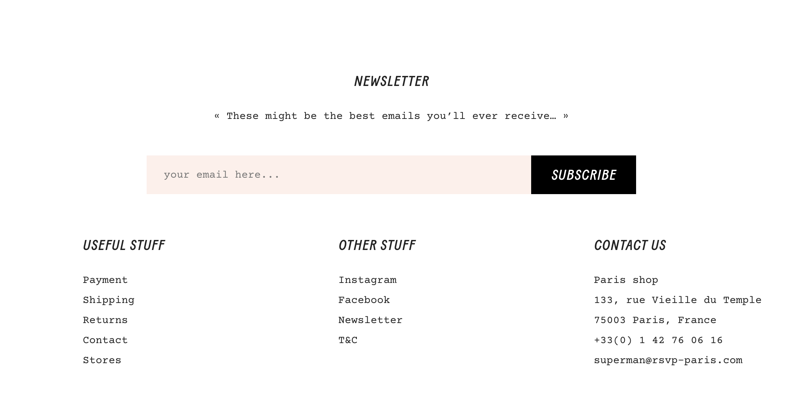

https://en.rsvp-paris.com/

# Elementos

* Link
* Botão
* Dropdown

## Link
* O Link é um dos principais elementos da web, ele que permite navegarmos entre diferentes páginas para consumirmos informações.

### Contraste
* O link deve se diferenciar do conteúdo que não é clicável. Essa diferença pode ser criada com espaço, posicionamento, ícones, cores ou sublinhado.

### Estado
* Os links geralmente possuem diferentes estados, um para quando o mouse passa por cima, outro para quando é clicado e um último para quando o link já foi visitado.

### Clicável
* Garantir que o ícone seja facilmente clicável, principalmente no mobile.

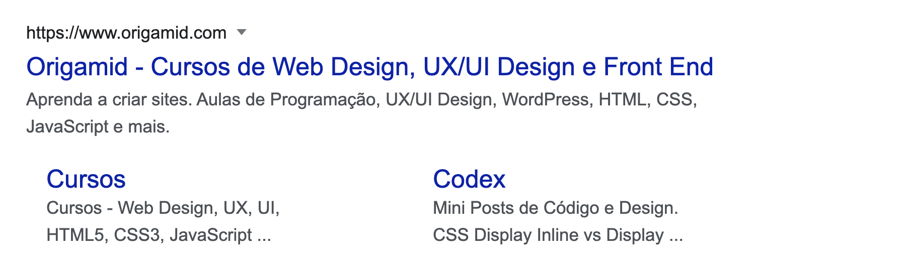

https://www.google.com/search?q=origamid

O posicionamento do texto pode indicar para o usuário que o mesmo é um link.

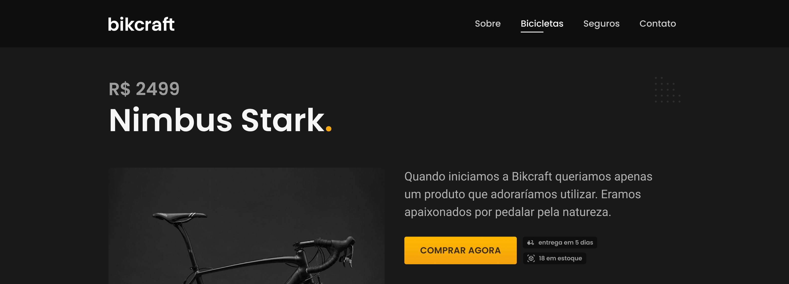

Quando o link está localizado no texto, precisamos adicionar outros elementos para criarmos contraste suficiente entre o que é e o que não é link.

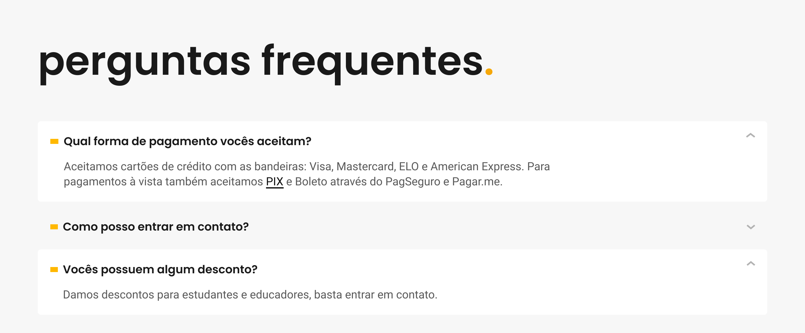

## Botão

### Funcionalidade

O botão pode funcionar como um link <a>, levando o usuário para outra página. Ou como o ativador de uma função <button>. Exemplos: um botão que adiciona um produto ao carrinho.

### Contraste

O botão deve se diferenciar dos demais conteúdos do site. Geralmente o texto do botão é envolvido em uma caixa.

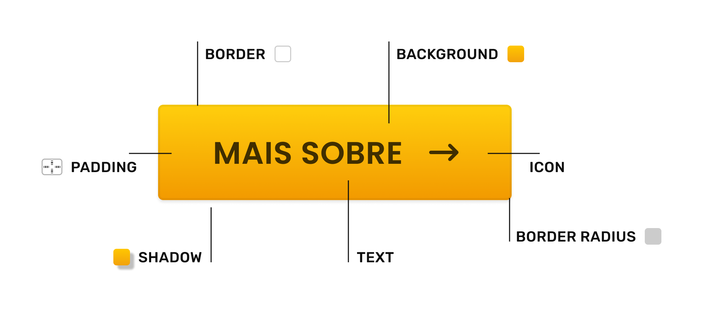

Na página inicial do Dropbox existem dois botões, com funcionalidades diferentes. O de começar funciona como um link, enquanto o de Registra-se possui a funcionalidade de cadastrar um novo usuário.

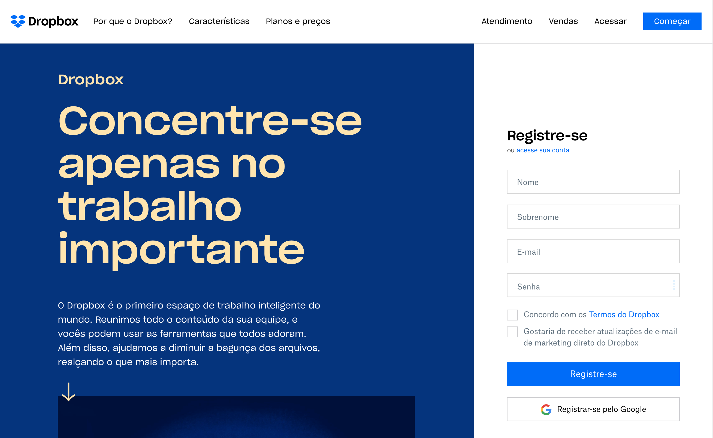

https://www.dropbox.com

O Github utiliza constantemente botões com cantos arredondados, assim como em outros elementos da interface.

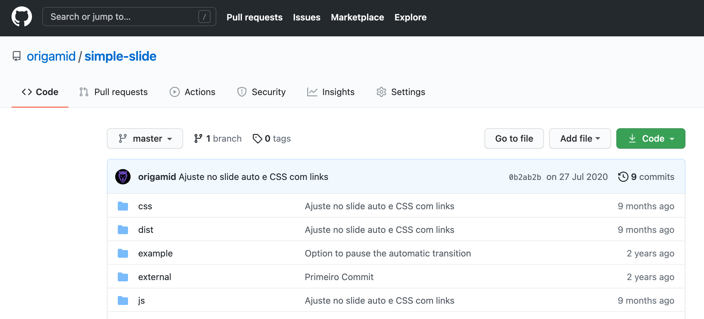

No site Cult Gaia, o uso de botões em linhas apenas se comunica com o uso de linhas na interface. O contraste do botão é atribuído ao seu tamanho.

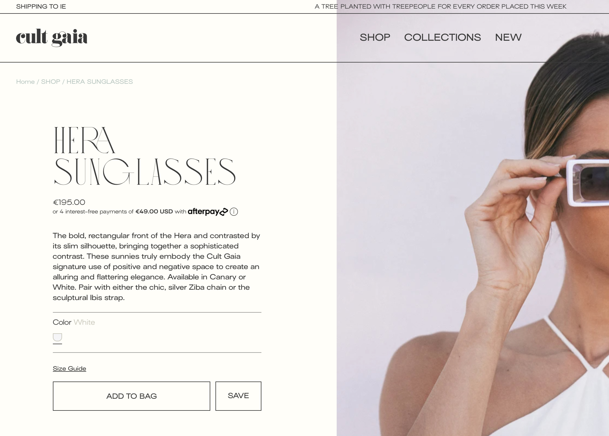

https://cultgaia.com/

## Dropdown
O Dropdown é uma caixa que geralmente contém outros links importantes, que aparecem ao clicarmos (ou passar o mouse por cima) de um botão/link.

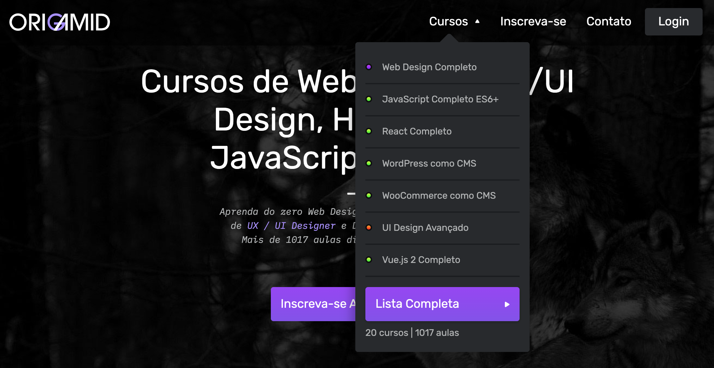

Não precisa ser uma lista simples, no Stripe eles utilizam um mega dropdown, que possui ícones e informações extras sobre cada link.

.png)

https://stripe.com/br
Os Dropdowns não precisam ser localizados apenas no menu principal, eles podem fazer parte de outros elementos da interface.

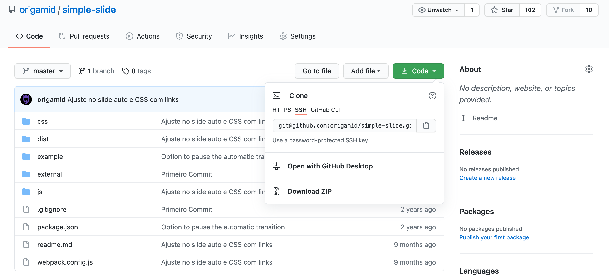

## Listas

### Didáticas
* Listas tornam a informação mais fácil de ser escaneada e digerida.

### Diferentes Tipos
* Seções, produtos, preços e posts

### Lista > Parágrafo
* Tente transformar descrições em listas.

## Seções
O conteúdo do site geralmente é dividido em uma lista de seções.

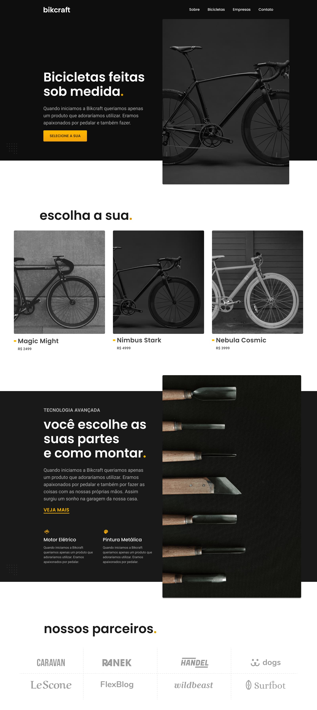

## Produtos
Listas são utilizadas para mostrar o catálogo de produtos. As informações mais comuns em uma lista de produtos são: foto, nome e preço.

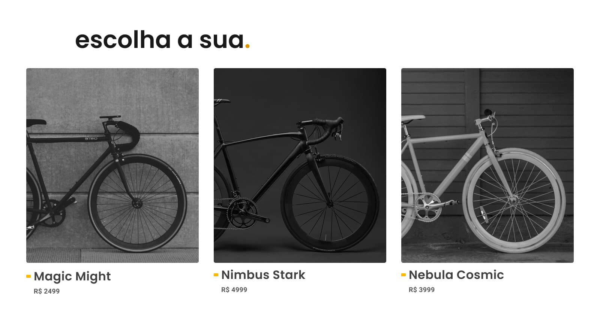

No site da Americanas informações como as avaliações dos usuários e etiquetas de descontos/oferta também fazem parte da lista.

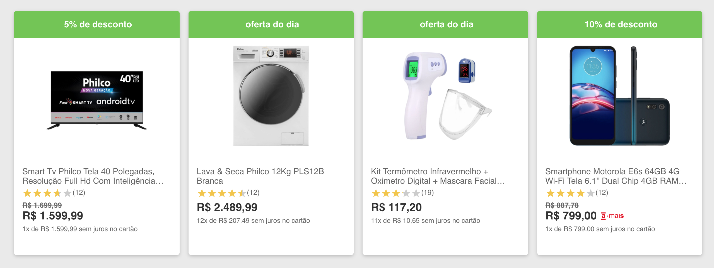

https://www.americanas.com.br/

## Preços
Listas de preços/planos geralmente comparam as diferenças entre os planos.

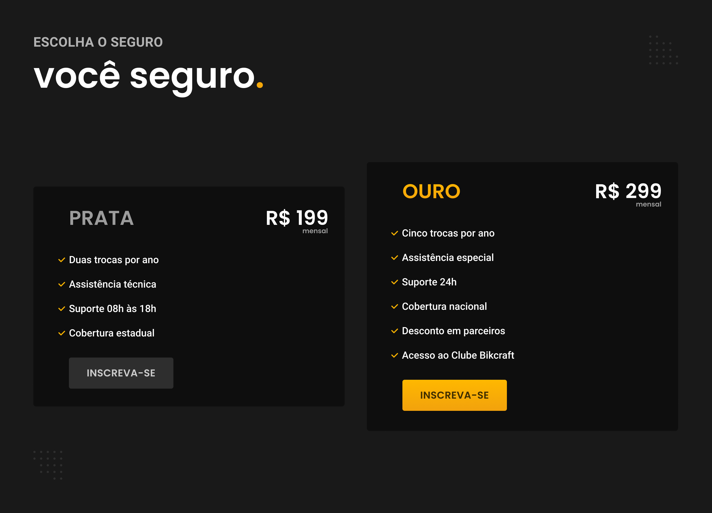

O Mailchimp recomenda com um banner o plano mais indicado para os clientes.

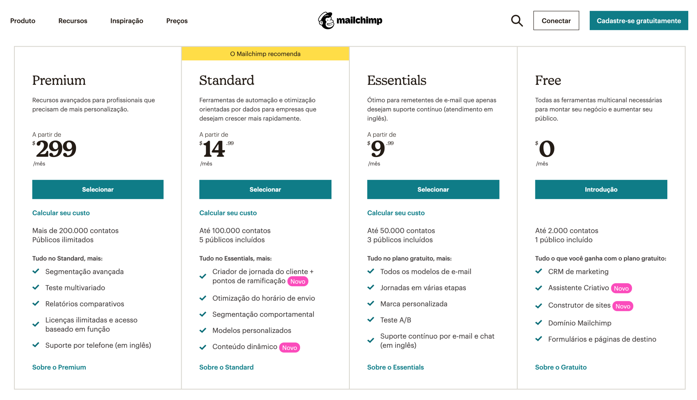

https://mailchimp.com/pt-br/pricing/

## Posts
Uma lista de postagens/notícias é presente em quase todas as redes sociais, blogs e sites de notícias. Elementos comuns são: autor, data, título, thumbnail, tags, breve descrição, likes (aprovações) e comentários.

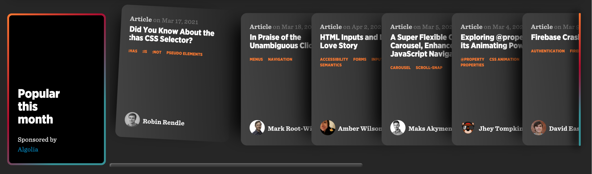

https://css-tricks.com/

As informações da lista são conforme as suas necessidades. No YouTube o tempo do vídeo, thumbnail e total assistido são essenciais.

## Conteúdo

### Reduza
* "Tire metade do conteúdo da página. E do que sobrar remova a outra metade." Steve Krug, Não me Faça Pensar

### Texto/Visual
* Adicione elementos visuais ao conteúdo para tornar o mesmo mais interessante. Ex: imagens, vídeos, ícones, decorações, etc.

### Interação
* Se o conteúdo fizer parte de uma rede social/blog/site de notícias, permita a interação através de comentários, reviews/aprovações ou outras.

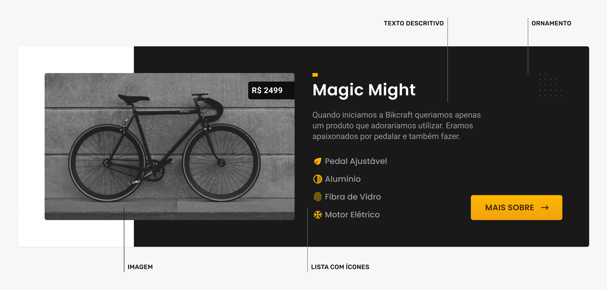

O Stripe combina informações sobre a empresa com um globo dinâmico que mostra transações efetuadas. Além disso ele também quebra dados da empresa em uma lista, ao invés de aprensetá-los dentro de um parágrafo.

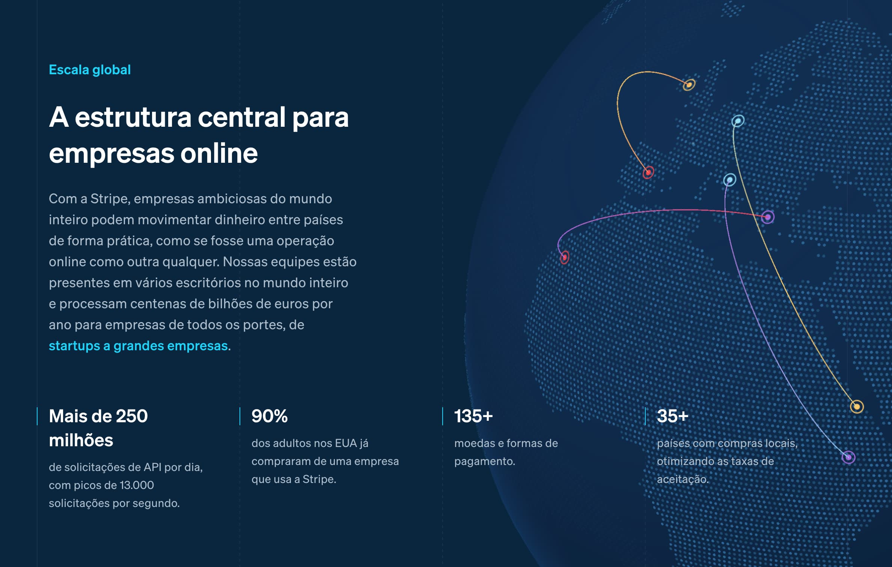

https://stripe.com/pt-br-ie

O Medium permite a interação com o conteúdo através de aplausos e comentários.

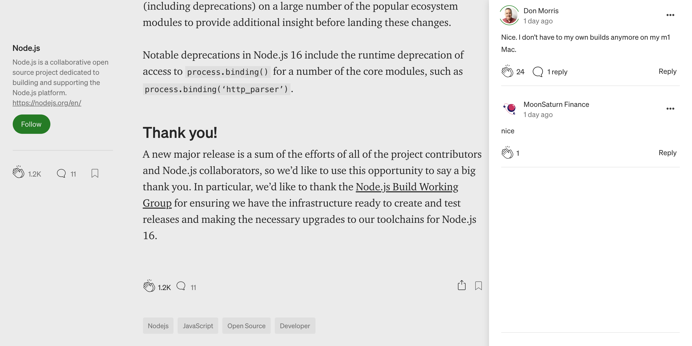

https://medium.com/

## Formulários

### Campos de Input
* text/textarea, checkbox/radio, select, slide, date.

### Tipos
* Contato, cadastro, login, busca.

## text/textarea

### Livre / Restrito
* Restrito: conteúdo deve ser específico, CPF, email e outros.

### Label
* Informa o que deve ser preenchido no campo.

### Placeholder
* Dica de como o conteúdo deve ser preenchido.

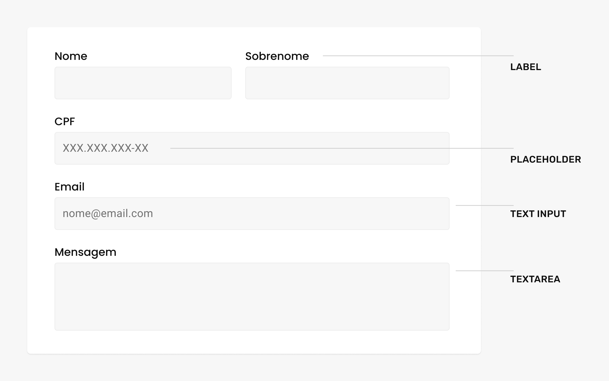

## checkbox/radio

### Checkbox
* Permite múltiplos campos ativos.

### Radio
* Permite apenas um item ativo do grupo.

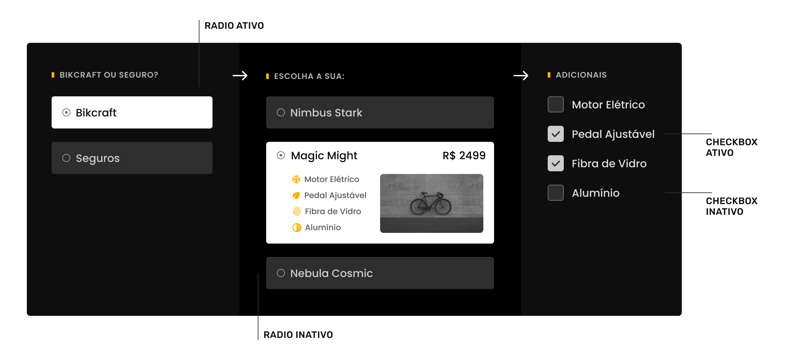

## select

### Opções
* Permite selecionar uma opção da lista. O múltiplo não é muito utilizado.

### Estilo
* O padrão do browser/dispositivo geralmente é suficiente.

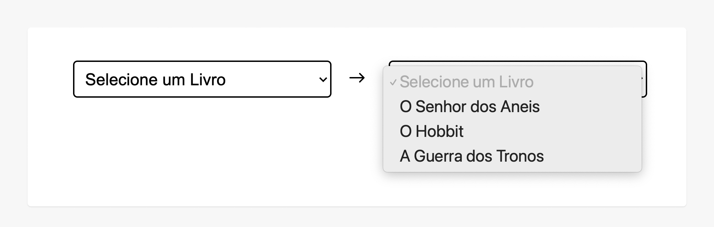

## slide

### Sem precisão
* Funciona para valores não precisos, como no volume de um vídeo.

### Min/Max
* Precisamos definir o valor mínimo e máximo do slide.

## date

### Reservas
* Utilizado em reservas de hotéis, passagens aéreas e mais.

### Início/Fim
* Indicar no calendário as datas selecionadas.

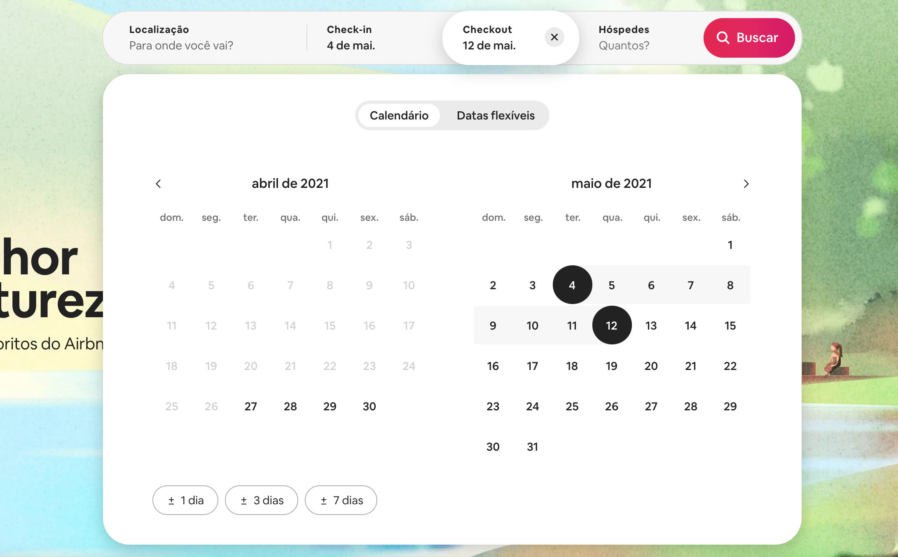

https://www.airbnb.com.br/

## Contato

#### Mínimo possível
* Peça a menor quantidade de informações possíveis.

#### Label e placeholder
* Label em cima no canto esquerdo.

### Feedback de erro / sucesso
* Informar se algum erro ocorrer ou se for enviado.

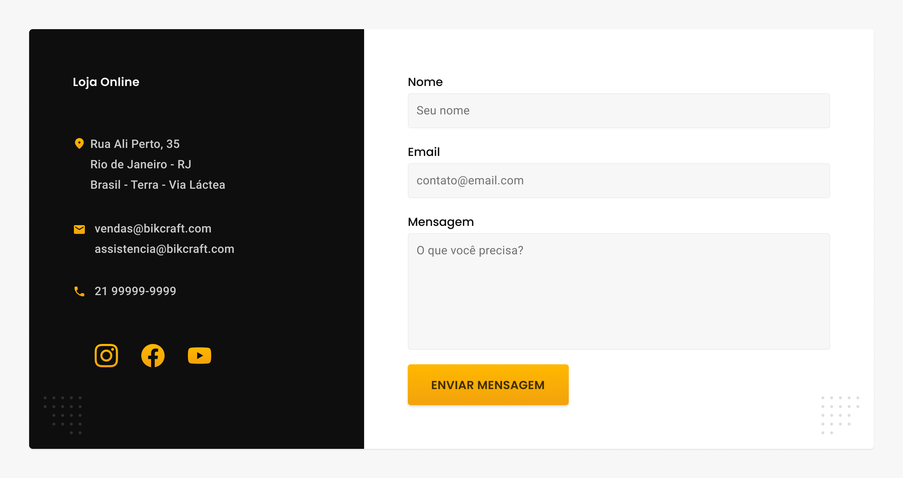

## Cadastro

### Simples
* Apenas informações necessárias. Resumo da compra.

### Placeholder
* Dica de como preencher CEP, Cartão e Outros.

### Uma página
* Tentar manter o processo em uma única página.

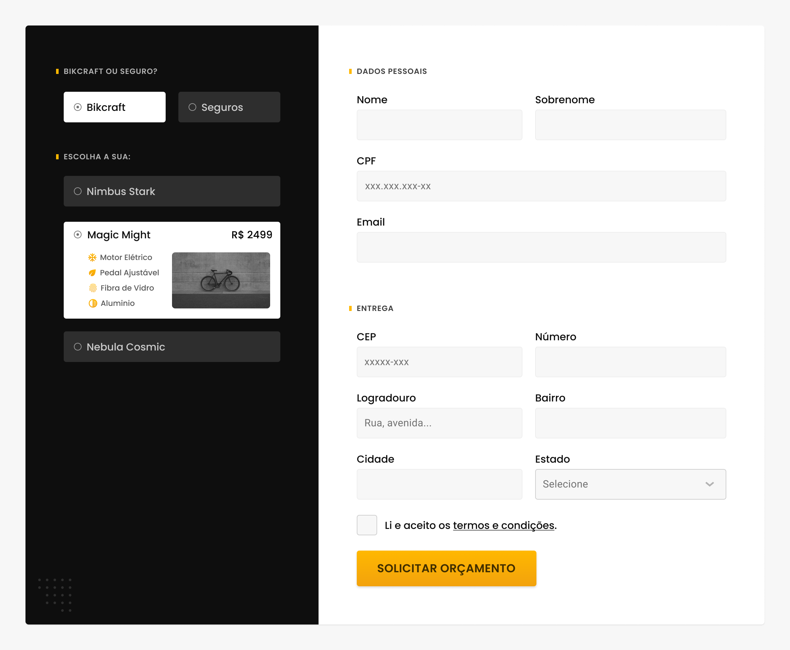

## Login

### Fácil acesso
* Facilitar o login dos usuários atuais

### Recuperação de senha
* Botão claro de recuperação de senha

### Cadastro
* Mostrar um link para se cadastrar, caso o usuário não possua conta.

## Busca

### Opções
* Para buscas mais complexas como de hoteis / viagens

### Auto-completar
* Com base nos resultados

### Retornar a palavra / opções buscadas
* Data escolhida, local e outros

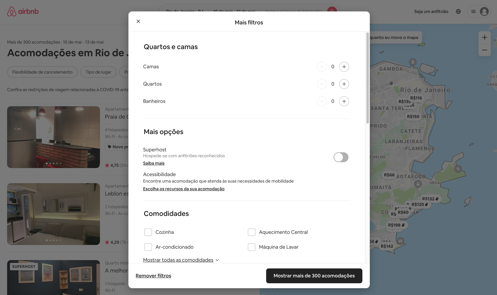

https://www.airbnb.com.br/

## Interfaces Responsivas

### Se adapta ao meio
* Tamanho da tela (pequena, média e grande), tipo da tela (touch ou não).

### Único Artefato
* Ao invés de ter um site para cada meio, ter um único site que se adapta.

### Acessibilidade
* Web para todos.

O YouTube esconde os itens do menu principal atrás do menu "hamburguer".

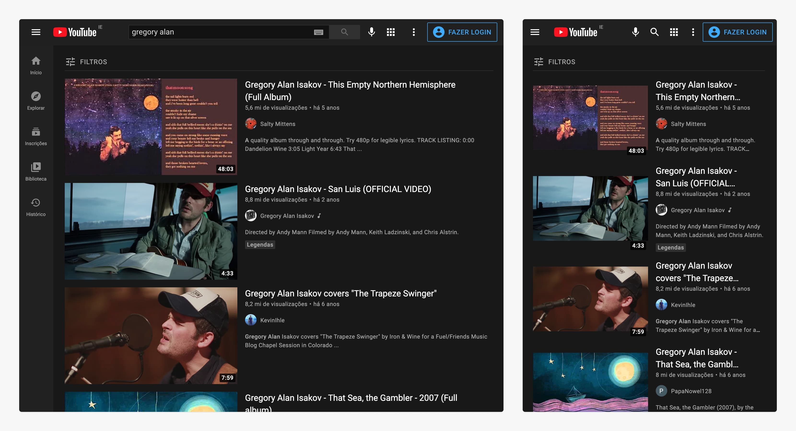

O Dropbox remove a visibilidade inicial do formulário de registro.

https://dropbox.com/

O Stripe remove a imagem ilustrativa e mantém apenas o texto.

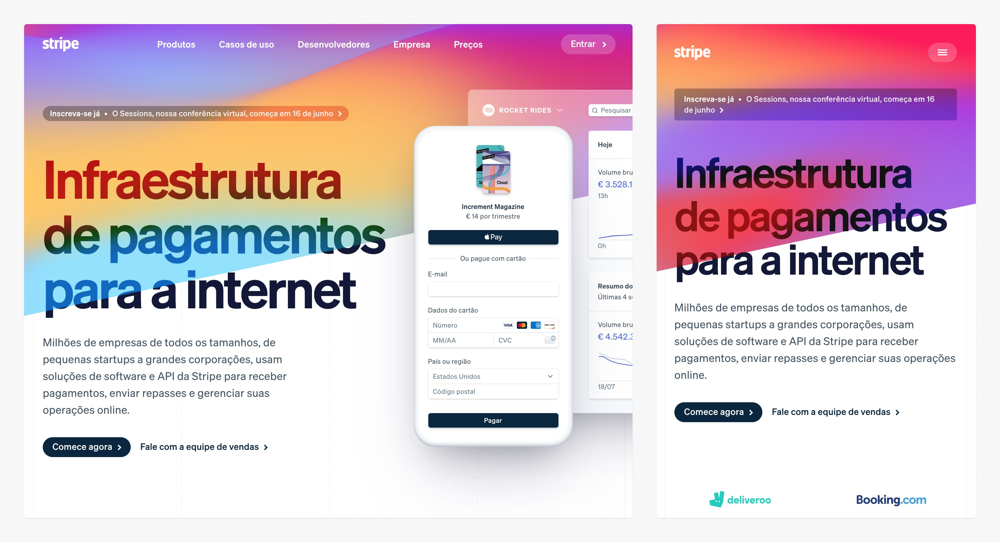

https://stripe.com/

## Boas Práticas

### Mantenha as Funcionalidades
* Não assuma as necessidades do seu usuário.

### Simplifique/Remova Ilustrações
* Ilustrações ou elementos decorativos que ocuparem boa parte da tela, podem ser removidos em telas menores.

### Simplifique a Interface
* Esconda opções do menu, diminua o total de itens mostrados.

### Touch
* O dedo não é tão preciso quanto o ponteiro do mouse.

## Navegação
O uso do menu mobile (hambúrguer), é uma forma de escondermos as opções de navegação através de um botão que mostra e esconde as mesmas.

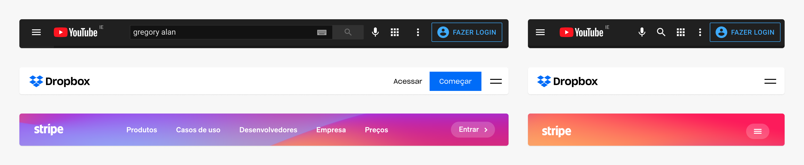

## Listas e Conteúdo

### Simplificar
* Remover imagens, ornamentos e a quantidade de itens mostrados.

### Recompor
* 3 itens em 3 colunas, se tornam 3 itens em uma coluna, um abaixo do outro.

### Slides Horizontais
* Usados para apresentar listas de itens (funcionam ao arrastarmos o dedo).

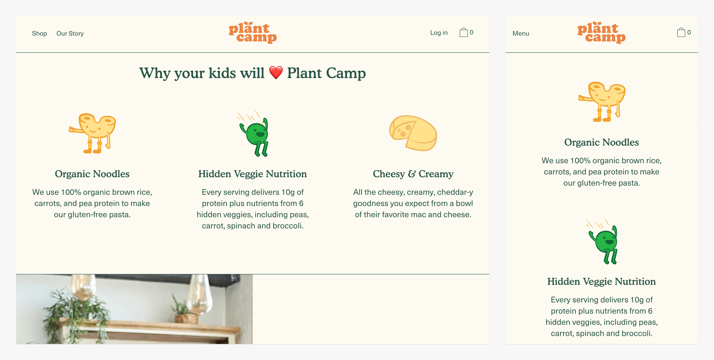

https://plantcamp.com/

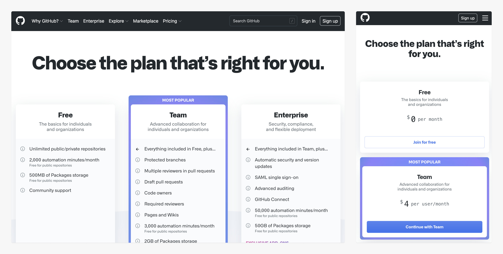

https://github.com/pricing

## Sistema de Design

### Design Systems
* Conjunto de regras/elementos que são definidos para garantir consistência entre interfaces da marca.

### Regras
* A regras são definidas para todos os elementos do design, como espaços, cores, tipografia, grid, formas, imagens, ícones e mais.

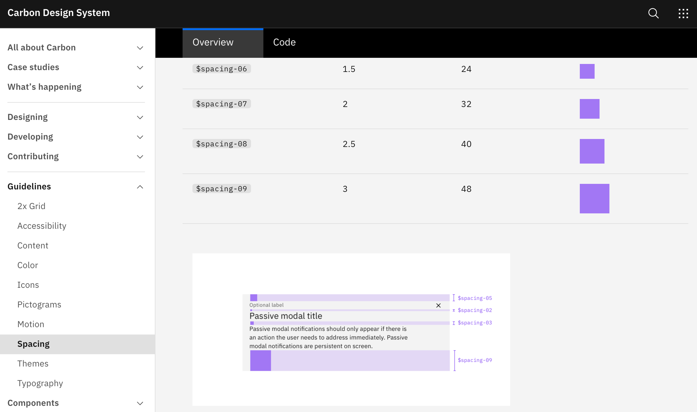

https://www.carbondesignsystem.com/

O sistema pode definir também como componentes comuns devem ser criados.

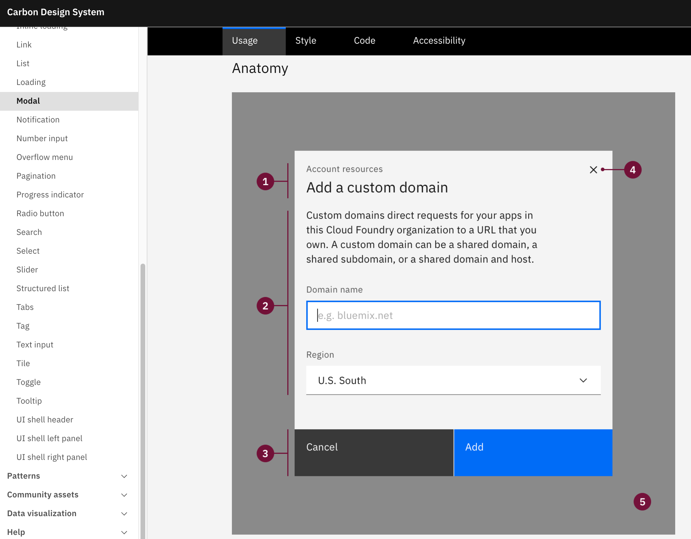

## Exemplos

### Material Design
https://material.io/

### Carbon Design
https://www.carbondesignsystem.com/

### Bootstrap
https://getbootstrap.com/

### Tailwind
https://tailwindcss.com/

## Vantagens e Desvantagens

### Vantagens
* Maior agilidade na composição de novas ideias e garante maior consistência entre diferentes projetos.

### Desvantagens
* Difícil de manter e pode acabar atrapalhando a geração de novas ideias.
